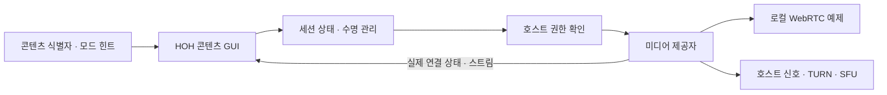

# HOH Interface 실시간 콘텐츠 확장

실시간 통화·영상 통화·방송은 HOH의 새 화면 종류가 아니라, 콘텐츠 뷰어에서 실행하는
프로그램 콘텐츠다. 따라서 피드·대시보드·AI 대화의 기본 구조는 그대로 유지한다.
이 문서는 사용자 요청을 바탕으로 만든 **확장 계약**이며, 배포 또는 운영 준비 완료 선언이 아니다.

## 사용자 경험 계약

콘텐츠 렌더러는 현재 콘텐츠의 `contentId`, 화면 버전, 취소 신호를 받아 세션을 연다.
화면에는 다음 상태를 명확히 보여야 한다.

| 모드 | 콘텐츠 안의 제어 | 표시해야 할 상태 |
| --- | --- | --- |
| 음성 통화 | 참가·음소거·나가기 | 대기·연결 중·연결됨·종료·오류 |
| 영상 통화 | 카메라·마이크·참가·나가기 | 권한 필요·미리보기·연결 상태·상대 참가 상태 |
| 방송 발행 | 카메라/화면·마이크·시작·종료 | 권한·발행 준비·라이브·종료·오류 |
| 방송 시청 | 재생·음소거·나가기 | 대기·시청 중·종료·오류 |

권한 요청은 사용자의 직접 조작 뒤에만 시작한다. 카메라·마이크·화면 공유는 사용자가
무엇을 공유하는지, 현재 공유 중인지, 언제 중단되는지를 콘텐츠 안에서 확인할 수 있어야 한다.
다른 콘텐츠로 이동하거나 렌더러가 폐기되면 해당 콘텐츠의 비동기 콜백은 현재 화면을 바꾸면 안 된다.

## 기술 인터페이스



`ui/realtime-session.js`는 UI와 미디어 제공자를 분리하는 선택적 세션 컨트롤러다.
호스트는 `provider`로 실제 미디어·신호 처리 방식을 주입하고, HOH 콘텐츠 렌더러는 세션의
상태와 명령만 사용한다. `realtime/contracts.d.ts`에는 선택적 타입 계약을 둔다.
`adapters/local-webrtc.js`는 같은 출처 탭에서 탐색·검증할 수 있는
`BroadcastChannel` 신호 경로와 브라우저 `RTCPeerConnection` 참조 구현이다.

`mountHohInterface`의 선택적 `realtime` 설정은 `{ provider, authorize }`다. `authorize`는
`{ context, request, signal }`을 받아, 검증된 `{ roomId, mode, role }`을 돌려야 한다.
콘텐츠 payload는 희망 `mode`와 `role` 힌트만 둘 수 있으며, 콘텐츠가 방 ID나 권한을 결정하지 않는다.
세션은 `getSnapshot`, `subscribe`, `isActive`, `join`, `leave`, `close`, `setMicrophone`,
`setCamera`, `shareScreen`, `stopScreenShare`를 제공한다. snapshot에는 상태, 로컬 스트림,
피어 스트림, 마이크·카메라·화면공유 상태, 오류, 기능 가능 여부가 포함된다.

프로덕션 호스트는 아래를 **자체 제공**해야 한다.

| 계층 | 호스트 책임 | 이 저장소의 범위 |
| --- | --- | --- |
| 신호 | 인증된 방 참여, offer/answer/ICE 전달, 재접속 정책 | 어댑터 경계와 로컬 참조 구현 |
| 연결 | ICE 서버, TURN 자격 증명 발급과 회전 | 구성값을 내장하지 않음 |
| 다자간 방송 | SFU 또는 동등한 미디어 배포 계층, 용량·품질 정책 | 인터페이스만 정의 |
| 권한·보호 | 참가 권한, 차단·신고, 녹화/보관 정책, 감사와 삭제 | 호스트 정책과 백엔드 책임 |
| 관측·장애 | 연결 품질, 오류, 서비스 상태 | UI가 상태를 표시할 수 있는 계약 |

브라우저 API 사용은 [WebRTC](https://www.w3.org/TR/webrtc/),
[Media Capture and Streams](https://www.w3.org/TR/mediacapture-streams/),
[Screen Capture](https://www.w3.org/TR/screen-capture/)를 참조한다. 이 링크는 기술 문서의
출처일 뿐, 규격 적합성 인증이나 서비스 배포를 뜻하지 않는다.

## 세션 생명주기

세션 snapshot 상태는 `idle`, `joining`, `waiting`, `connected`, `reconnecting`, `error`,
`closed`다. 권한 거부·연결 실패·호스트 정책 거절은 오류 상태로 남고, 재시도는 사용자 또는
호스트 정책이 결정한다. `closed`와 오류 상태에서는 트랙·피어·신호 구독을 정리한다.

세션은 셸이 소유하며 시작한 `contentId`에 묶인다. DOM 렌더러의 수명과는 별개다.
콘텐츠 이동은 활성 통화에서 나갈지 먼저 확인한다.
같은 콘텐츠의 재렌더링은 세션을 유지한다. 페이지 이탈·셸 폐기는 미디어를 종료한다. 취소 신호,
세션 종료 중 어느 하나가 발생하면 오래된 세션 이벤트를 무시하고 자원을 정리한다.
현재 AI 요청에는 콘텐츠 식별자·화면 버전·사용자 메시지만 전달한다. 미디어 스트림은
AI에 전달하지 않으며, 카메라·마이크·화면 공유 시작은 GUI의 직접 조작으로 한정한다.

## 현재 상태와 준비 기준

| 항목 | 상태 | 근거/다음 기준 |
| --- | --- | --- |
| HOH 콘텐츠 렌더러 수명·컨텍스트 경계 | 구현됨 | 기존 `signal`, `isCurrent`, 콘텐츠 버전 계약 |
| 선택적 실시간 세션/로컬 WebRTC 어댑터 | 로컬 구현·검증 | 실제 RTCPeerConnection 영상·음성, 테스트용 캡처 장치 사용 |
| 실제 사용자 간 통화·방송 배포 | 미배포 | 인증된 신호, TURN, SFU, 권한·보호·관측 검증 필요 |
| HSWM 연결 실행 | 준비되지 않음 | 이 실시간 확장과 별개로 해당 연결 절차가 필요 |

그래프는 원문·AI 해석·구현 관찰을 분리한다. 구현 파일의 바이트 해시와
[로컬 검증 기록](../provenance/verification-interface-0.2.0.json)을 연결한다.

## 실행과 연결 예제

```sh
npm run preview -- --port 8021
```

`http://127.0.0.1:8021/realtime/`를 같은 브라우저의 두 탭에서 연다. 음성/영상 통화는
같은 앱에서 참여하고, 방송은 한 탭에서 시작한 뒤 다른 탭에서 시청한다. `?room=meeting-1`
처럼 이름을 지정해 예제 방을 나눌 수 있다. 예제의 즐겨찾기·댓글·상태는 메모리에만 있고,
브라우저를 새로 열면 초기화된다. 개인 계정이나 AI 서비스에는 연결하지 않는다.

```js
mountHohInterface({
  root, adapter,
  realtime: {
    provider: hostMediaProvider,
    async authorize({ context, request, signal }) {
      // The host verifies its authenticated user's access and publishing role.
      const response = await fetch('/my-service/rooms/admit', {
        method: 'POST', signal,
        headers: { 'Content-Type': 'application/json' },
        body: JSON.stringify({ contentId: context.contentId, ...request })
      });
      if (!response.ok) throw new Error('이 방에 참여할 권한이 없습니다.');
      return response.json(); // { roomId, mode, role, ...providerSpecificGrant }
    }
  }
});
```

`REALTIME` 콘텐츠 payload에는 `{ realtime: { mode:'video', role:'participant' } }`를
넣는다. 방송은 `mode:'broadcast'`, `role:'publisher'` 또는 `role:'viewer'`를 사용한다.
권한 콜백이 없거나 제공자가 없으면 참여 버튼을 비활성화하고 미연결 상태를 표시한다.
콜백은 호스트의 기존 인증·CSRF 계약에 맞게 구현해야 한다. 허용된 방·역할·기능을
검증하고 짧은 수명의 연결 정보를 주는 책임은 실제 서버에 있다.

같은 브라우저의 로컬 제공자는 기본 피어 상한 4개(설정 최대 8개)다. 외부 ICE 서버를
자동 연결하지 않는다. 신호는 BroadcastChannel, 미디어는 실제 WebRTC로 전달하며,
다른 기기나 브라우저 프로필 사이의 통화 제공자는 아니다. 운영용 제공자는 같은 계약으로
대체할 수 있다. 큰 방송의 SFU/HLS·네이티브 백그라운드 통화·푸시 수신·녹화는 제공하지 않는다.

마이크/카메라 끄기는 트랙을 비활성화한다. 나가기·페이지 이탈·셸 폐기는 트랙을 완전히
중지한다. 화면 선택 취소는 기존 통화를 유지한다. 장치 손실·신호 오류 때는 상황을 보여주며,
자동 복구가 되지 않으면 나간 뒤 다시 참여할 수 있다. 화면 캡처는 브라우저가 지원하는
환경에서 직접 버튼을 눌러 시작해야 한다. 로컬 테스트의 화면 공유는 합성 영상 트랙으로
교체·정리 경로를 검사하며 운영체제의 화면 선택기를 검증한 결과는 아니다.
